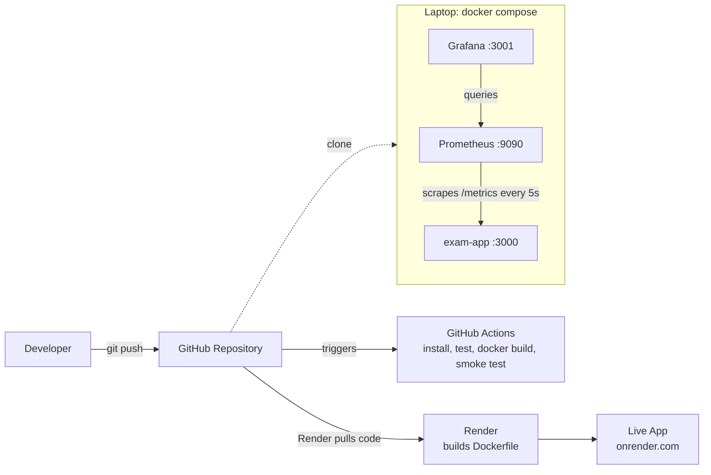

# 📝 Online Examination System — End-to-End DevOps Mini Project

A working online exam portal (student + admin) built with **Node.js / Express**, containerized with **Docker**, tested with **Jest**, automated with **GitHub Actions**, deployed on **Render**, and monitored with **Prometheus + Grafana**.

| | |
|---|---|
| 🌐 **Live app** | https://online-exam-system-1-jxz6.onrender.com/ |
| 💻 **Source code** | https://github.com/arju8400/online-exam-system |
| ❤️ **Health check** | https://online-exam-system-1-jxz6.onrender.com/health |

> ⏳ **Note:** The live app is on Render's **free plan**. It goes to sleep after ~15 minutes of no traffic, so the **first load can take about a minute**. Please wait and refresh.

---

## 📑 Table of Contents

1. [About the Project](#1-about-the-project)
2. [Honest Note on How This Was Built](#2-honest-note-on-how-this-was-built)
3. [Features](#3-features)
4. [Tech Stack](#4-tech-stack)
5. [DevOps Workflow & Architecture](#5-devops-workflow--architecture)
6. [Project Structure](#6-project-structure)
7. [API Reference](#7-api-reference)
8. [Run Locally (without Docker)](#8-run-locally-without-docker)
9. [Run with Docker (App + Prometheus + Grafana)](#9-run-with-docker-app--prometheus--grafana)
10. [Monitoring: Prometheus](#10-monitoring-prometheus)
11. [Monitoring: Grafana](#11-monitoring-grafana)
12. [Testing](#12-testing)
13. [CI Pipeline (GitHub Actions)](#13-ci-pipeline-github-actions)
14. [Deployment on Render](#14-deployment-on-render)
15. [Configuration & Security](#15-configuration--security)
16. [Troubleshooting](#16-troubleshooting)
17. [Known Limitations](#17-known-limitations)
18. [Future Scope](#18-future-scope)
19. [DevOps Requirement Checklist](#19-devops-requirement-checklist)
20. [Quick Command Cheat Sheet](#20-quick-command-cheat-sheet)

---

## 1. About the Project

This is a **DevOps mini project**. The goal is not only to build an application, but to show how code travels from the developer's laptop to a **live, monitored** application:

```
Code → Git/GitHub → CI (build + test) → Docker image → Deployment → Monitoring
```

The application is an **Online Examination System** where a student logs in, reads instructions, attempts a timed multiple-choice exam, and gets an instant score. An admin can create exams and see everyone's results.

---

## 2. Honest Note on How This Was Built

In the interest of transparency:

- The **application code, Docker/CI/monitoring configuration, and this documentation were generated with the help of Claude**, an AI assistant made by Anthropic, based on the college's DevOps mini project instructions.
- The student (**Arju**, GitHub: `arju8400`) set up the tools on their own system, ran and tested the project, pushed it to GitHub, deployed it to Render, ran it in Docker, and built the Grafana dashboard.
- Claude **could not run Docker** while building the project. Only the backend tests (`npm test`) were run by Claude; the Docker, Prometheus, Grafana, and Render parts were run and verified by the student on their own machine.
- Anyone using this project should be able to explain every part of it. This README is written to help with that.

---

## 3. Features

### 👨‍🎓 Student
- Login with username and password
- See the list of available exams
- **Instructions page** with an "I agree" checkbox before the exam starts
- One question at a time, with **Save & Next**, **Mark for Review & Next**, **Clear Response**, and **Previous**
- **Question palette** (grid of numbers) with colours:
  - Grey = Not Visited
  - Red = Not Answered
  - Green = Answered
  - Purple = Marked for Review
- **Countdown timer** (blinks red in the last minute); the exam **auto-submits** when time ends
- **Submit confirmation popup** showing answered / not answered / marked counts
- **Result page**: score, percentage, PASS/FAIL (pass mark = 40%)

### 🛡️ Exam rules (browser-level)
- Tab / window switch is detected; after **3 violations** the exam is auto-submitted
- Right-click, copy, cut, and paste are disabled during the exam
- Fullscreen is requested at the start
- Browser warns before accidental refresh/close

### 👩‍💼 Admin
- Create a new exam (title, duration, questions in JSON)
- View **all** students' results

### ⚙️ Backend
- REST API with token-based login
- **Role-based access** (student vs admin)
- Correct answers are **never sent to the browser**; the score is calculated on the server
- Results are saved to a JSON file (kept in a Docker volume when running with Docker)
- `/health` endpoint and `/metrics` endpoint (for Prometheus)

---

## 4. Tech Stack

| Area | Tool |
|---|---|
| Frontend | HTML, CSS, vanilla JavaScript |
| Backend | Node.js 20, Express |
| Testing | Jest, Supertest |
| Version control | Git, GitHub |
| CI | GitHub Actions |
| Containerization | Docker (`node:20-alpine` base image), Docker Compose |
| Deployment | Render (free web service, Docker runtime) |
| Metrics library | `prom-client` |
| Monitoring | Prometheus, Grafana |

---

## 5. DevOps Workflow & Architecture



**How to read it:**

| Stage | What happens |
|---|---|
| 1. Develop | Code is written in `src/` (backend) and `public/` (frontend) |
| 2. Version control | Code is committed and pushed to GitHub |
| 3. CI | On every push, GitHub Actions installs dependencies, runs tests, builds the Docker image, and smoke-tests the container |
| 4. Containerize | `Dockerfile` packages the app with everything it needs |
| 5. Deploy | Render builds the same `Dockerfile` and serves the app on a public URL |
| 6. Monitor | Prometheus collects metrics from `/metrics`; Grafana shows them on a dashboard (run with Docker Compose on the laptop) |

**Simple analogy:** Docker is a **tiffin box**: the app and everything it needs are packed together, so it runs the same everywhere.

---

## 6. Project Structure

```
exam-system/
├── src/
│   ├── app.js              # Express app: routes, auth, scoring, metrics
│   └── server.js           # Starts the server (reads PORT, DATA_FILE)
├── public/
│   ├── index.html          # All screens (login, home, instructions, exam, result)
│   ├── style.css           # Exam-portal styling
│   └── app.js              # Frontend logic (timer, palette, rules)
├── tests/
│   └── api.test.js         # 7 Jest + Supertest tests
├── prometheus/
│   └── prometheus.yml      # Scrape config (target: app:3000)
├── grafana/
│   └── provisioning/
│       └── datasources/
│           └── datasource.yml   # Auto-connects Grafana to Prometheus
├── .github/
│   └── workflows/
│       └── ci.yml          # GitHub Actions pipeline
├── Dockerfile              # Builds the app image
├── docker-compose.yml      # Runs app + Prometheus + Grafana together
├── .dockerignore
├── .gitignore
├── package.json
└── README.md
```

---

## 7. API Reference

| Method | Endpoint | Who | What it does |
|---|---|---|---|
| POST | `/api/login` | Anyone | Body `{username, password}` → returns `{token, role}` |
| GET | `/api/exams` | Logged in | List exams (title, duration, number of questions) |
| GET | `/api/exams/:id` | Logged in | Exam questions **without answers** |
| POST | `/api/exams/:id/submit` | **Student** | Body `{answers:[...]}` → returns score |
| POST | `/api/exams` | **Admin** | Create a new exam |
| GET | `/api/results` | Logged in | Student: own results. Admin: all results |
| GET | `/health` | Public | `{"status":"ok"}` |
| GET | `/metrics` | Public | Prometheus metrics (plain text) |

Authentication uses a token sent as `Authorization: Bearer <token>`.

---

## 8. Run Locally (without Docker)

**Requirements:** Node.js 20, Git

```bash
git clone https://github.com/arju8400/online-exam-system.git
cd online-exam-system
npm install
npm test
npm start
```

Open **http://localhost:3000**

Default local logins (used only when no environment variables are set):

| Role | Username | Password |
|---|---|---|
| Student | `student` | `student123` |
| Admin | `admin` | `admin123` |

Stop the server with **Ctrl + C**.

> **Windows tip:** If a folder was unzipped twice (`exam-system\exam-system`), go into the inner folder. `package.json` must be visible when you run `dir`.

---

## 9. Run with Docker (App + Prometheus + Grafana)

**Requirements:** Docker Desktop (wait until it shows **"Engine running"**).

```bash
docker compose up -d --build
```

The first run downloads about 1 GB of images (Node, Prometheus, Grafana), so it can take several minutes. Later runs take seconds.

### What starts

| Container | Image | URL |
|---|---|---|
| `exam-app` | built from this repo's `Dockerfile` | http://localhost:3000 |
| `prometheus` | `prom/prometheus` | http://localhost:9090 |
| `grafana` | `grafana/grafana` | http://localhost:3001 |

### Verify

```bash
docker ps          # should show 3 containers with status "Up"
docker images      # should list online-exam-system
```

### Useful commands

```bash
docker compose logs app      # app logs
docker compose down          # stop everything (data volume is kept)
docker compose down -v       # stop AND delete saved exam data
```

### How the Dockerfile works

```dockerfile
FROM node:20-alpine          # small Linux image with Node 20
WORKDIR /app
COPY package*.json ./
RUN npm ci --omit=dev        # install only production dependencies
COPY src ./src
COPY public ./public
ENV PORT=3000
EXPOSE 3000
CMD ["node", "src/server.js"]
```

### How `docker-compose.yml` works

- **app**: built from the `Dockerfile`, port `3000`, stores data in a named volume (`exam-data`) so results survive restarts.
- **prometheus**: reads `prometheus/prometheus.yml` and scrapes the app.
- **grafana**: reads `grafana/provisioning/` so the Prometheus data source is already connected.
- All three share one Docker network, so Prometheus reaches the app at the name `app:3000`.

---

## 10. Monitoring: Prometheus

**Prometheus** collects numbers (metrics) from the app every **5 seconds** by calling `http://app:3000/metrics`.

### Config (`prometheus/prometheus.yml`)

```yaml
global:
  scrape_interval: 5s
scrape_configs:
  - job_name: 'exam-app'
    static_configs:
      - targets: ['app:3000']
```

### Custom metrics added in the app

| Metric | Type | Meaning |
|---|---|---|
| `http_requests_total{method,route,status}` | Counter | Total HTTP requests |
| `exam_logins_total{result}` | Counter | Logins, labelled `success` or `fail` |
| `exam_submissions_total` | Counter | Exams submitted |
| `process_*`, `nodejs_*` | Default | CPU, memory, event-loop lag, etc. |

### Check that it works

1. Open **http://localhost:9090/targets** → `exam-app` must show **UP** (green).
2. Open **http://localhost:9090** and run queries:

| Query | Shows |
|---|---|
| `up` | 1 = app is reachable |
| `http_requests_total` | Requests per route/status |
| `exam_logins_total` | Success vs fail logins |
| `exam_submissions_total` | Exams submitted |

> ⚠️ A counter appears **only after the first event**. If `http_requests_total` is empty, send some traffic first (see below).

### Generate test traffic (Windows PowerShell)

Send traffic to the Docker app (use `127.0.0.1` to be sure you hit the container):

```powershell
1..15 | ForEach-Object {
  try { Invoke-RestMethod -Uri http://127.0.0.1:3000/api/login -Method Post -ContentType 'application/json' -Body '{"username":"student","password":"wrong"}' | Out-Null } catch {}
  $r = Invoke-RestMethod -Uri http://127.0.0.1:3000/api/login -Method Post -ContentType 'application/json' -Body '{"username":"student","password":"student123"}'
  Invoke-RestMethod -Uri http://127.0.0.1:3000/api/exams/1/submit -Method Post -Headers @{Authorization="Bearer $($r.token)"} -ContentType 'application/json' -Body '{"answers":[0,1,0,1,0,1,2,0,1,0]}' | Out-Null
  Start-Sleep -Seconds 2
}
```

This sends 15 failed logins, 15 successful logins, and 15 exam submissions.

> Traffic sent to the **Render** URL does **not** appear in the local Prometheus. Only the Docker container on your laptop is scraped.

---

## 11. Monitoring: Grafana

**Grafana** draws graphs from Prometheus data.

1. Open **http://localhost:3001**
2. Login: `admin` / `admin` (Grafana's default; you may skip the password change)
3. The **Prometheus** data source is already connected (via `grafana/provisioning`)

### Build the dashboard

Go to **Dashboards → New → New dashboard**, add a panel, select **Prometheus**, switch the query editor to **Code**, paste the query, click **Run queries**, set the **Title**, then **Back to dashboard**.

| Panel title | Query | Visualization |
|---|---|---|
| Requests per Second | `sum(rate(http_requests_total[1m]))` | Time series |
| Total Exam Submissions | `exam_submissions_total` | Stat |
| Logins (success / fail) | `exam_logins_total` | Bar chart |
| App Status | `up` | Stat |
| Memory Usage | `process_resident_memory_bytes` | Time series |

Finally set the time range to **Last 15 minutes**, refresh to **5s**, and click **Save** → name it `Online Exam System Monitoring`.

> If a panel shows **"No data"**: generate traffic (Section 10), set the time range to **Last 5 minutes**, and click **Run queries**. Rate queries need 1–2 minutes of traffic.

---

## 12. Testing

Tests use **Jest** and **Supertest** and run without a running server.

```bash
npm test
```

| # | Test | Checks |
|---|---|---|
| 1 | Health endpoint | `/health` returns 200 and `ok` |
| 2 | Wrong password | Login returns 401 |
| 3 | Authentication | `/api/exams` without a token returns 401 |
| 4 | No answer leak | Exam questions do not contain the `answer` field |
| 5 | Scoring | Correct answers give the correct score |
| 6 | Roles | Student cannot create an exam (403); admin can (201) |
| 7 | Metrics | `/metrics` contains custom metrics |

Expected result: **7 passed**.

---

## 13. CI Pipeline (GitHub Actions)

File: `.github/workflows/ci.yml`

**Triggers:** push to `main` or `develop`, and pull requests to `main`.

**Steps:**

1. Checkout code
2. Set up Node.js 20 (with npm cache)
3. `npm ci` — install dependencies
4. `npm test` — run the 7 tests
5. `docker build` — build the Docker image
6. **Smoke test** — start the container and call `/health`

A **green tick** on the repo's **Actions** tab means all steps passed. A failed test or build shows a red cross, which blocks bad code from going unnoticed.

---

## 14. Deployment on Render

The app is deployed from this GitHub repository using Render's **Docker** runtime.

| Setting | Value |
|---|---|
| Service type | Web Service |
| Source | Public Git repository `arju8400/online-exam-system` |
| Language / Runtime | Docker (uses the repo's `Dockerfile`) |
| Branch | `main` |
| Instance type | Free |
| Health check path | `/health` |
| Environment variables | `ADMIN_PASSWORD`, `STUDENT_PASSWORD` |

Render provides the `PORT` variable automatically, and the app reads it (`process.env.PORT`).

**Updating the live app:** push new code to GitHub. If auto-deploy is not connected (the repo was added as a *Public Git Repository*), open the Render dashboard → **Manual Deploy → Deploy latest commit**.

**Free plan behaviour:**
- Sleeps after ~15 minutes of inactivity (first request is slow)
- No persistent disk, so saved results may reset on restart or redeploy

---

## 15. Configuration & Security

### Environment variables

| Variable | Default | Purpose |
|---|---|---|
| `PORT` | `3000` | Port the server listens on |
| `ADMIN_PASSWORD` | `admin123` | Admin login password |
| `STUDENT_PASSWORD` | `student123` | Student login password |
| `DATA_FILE` | `data/db.json` | Where results and exams are saved |

### Security notes

- **On Render, passwords are set in the Render dashboard (Environment tab), not in the code.** Never commit real passwords, API keys, or tokens to GitHub.
- The defaults (`admin123`, `student123`) are public in this repository. They are **only for local demo**.
- `.gitignore` excludes `node_modules`, `data/db.json`, and `.env`.
- Correct answers stay on the server; the browser never receives them.

**Login tip:** the **username** is always `student` or `admin`. `STUDENT_PASSWORD` / `ADMIN_PASSWORD` are only the *names* of the settings; the *value* you typed there is the password.

---

## 16. Troubleshooting

| Problem | Fix |
|---|---|
| `npm` says `package.json` not found | You are in the wrong folder. Run `dir` and go into the folder that contains `package.json` |
| `https://localhost:3000` shows an SSL error | Use `http://` (no "s") |
| Login says "Invalid credentials" | Username must be `student` or `admin` (small letters). Password is the value from Render's Environment (or the local defaults) |
| `docker` cannot connect to the daemon | Open Docker Desktop and wait for "Engine running" |
| Docker pull is very slow | Normal on first run (~1 GB). Do not press Ctrl+C unless there is no progress for 15–20 minutes |
| Port 3000 already in use | Stop `npm start` (Ctrl+C) or run `docker compose down` |
| Render page takes ~1 minute to open | Free plan was sleeping; wait and refresh |
| Prometheus target is DOWN | Run `docker compose logs app` |
| Prometheus `http_requests_total` is empty | No request has reached the container yet; send traffic (Section 10) |
| Grafana shows "No data" | Generate traffic, set range to Last 5 minutes, click Run queries |
| Old UI after update | Use `docker compose up -d --build` and hard refresh (Ctrl + F5) |

---

## 17. Known Limitations

Being honest about what this project is **not**:

- **Users are fixed** (one student, one admin). There is no registration, and passwords are not hashed or stored in a database.
- **Sessions are kept in memory**, so they are lost when the server restarts.
- **Data is stored in a JSON file**, not a real database. It is not suitable for many users at the same time.
- **Proctoring is browser-level only.** Tab-switch detection can be bypassed by a determined person; there is no camera or AI monitoring.
- On Render's free plan, data may reset and the app sleeps when idle.
- `/metrics` is public (fine for a demo, not for production).
- Prometheus and Grafana run only in the local Docker Compose setup, not on Render.

---

## 18. Future Scope

- Real database (MongoDB / PostgreSQL) as another Docker container
- User registration with hashed passwords (bcrypt) and JWT
- Per-student exam assignment, randomized questions, and negative marking
- Export results as CSV / PDF
- Record tab-switch violations on the server and expose them as a Prometheus metric
- Kubernetes deployment manifests
- Alerting rules in Prometheus / Grafana
- Push the Docker image to Docker Hub or GitHub Container Registry from CI

---

## 19. DevOps Requirement Checklist

Mapped to the college's DevOps mini project instructions:

| Requirement | Where in this project | Status |
|---|---|---|
| Working application (web / API) | `src/`, `public/` | ✅ |
| Git + GitHub with commit history, branches | GitHub repository | ✅ |
| CI using GitHub Actions | `.github/workflows/ci.yml` | ✅ |
| Build and automated tests with results | `npm test` (7 tests) + Actions run | ✅ |
| Dockerfile and Docker image | `Dockerfile` | ✅ |
| Running container, accessible app | `docker compose up`, `localhost:3000` | ✅ |
| Deployment with evidence | Render live URL | ✅ |
| Prometheus + Grafana with a dashboard | `prometheus/`, `grafana/`, `localhost:3001` | ✅ |
| Documentation / report | This README + project report | ✅ |
| No secrets in GitHub | Passwords via Render environment variables | ✅ |

---

## 20. Quick Command Cheat Sheet

```bash
# --- Local ---
npm install
npm test
npm start                         # http://localhost:3000

# --- Docker ---
docker compose up -d --build      # start app + Prometheus + Grafana
docker ps                         # running containers
docker images                     # built images
docker compose logs app           # app logs
docker compose down               # stop everything

# --- Git ---
git add .
git commit -m "meaningful message"
git push
```

| URL | What |
|---|---|
| http://localhost:3000 | App (Docker / local) |
| http://localhost:3000/metrics | Raw metrics |
| http://localhost:9090 | Prometheus |
| http://localhost:9090/targets | Prometheus target health |
| http://localhost:3001 | Grafana |
| https://online-exam-system-1-jxz6.onrender.com/ | **Live app** |

---

## 👥 Team

| Name | GitHub | Role |
|---|---|---|
| Arju | [@arju8400](https://github.com/arju8400) | Development, DevOps setup, deployment, monitoring |
| *(add teammate)* | *(add GitHub)* | *(add role)* |
| *(add teammate)* | *(add GitHub)* | *(add role)* |

*College DevOps Mini Project — Online Examination System.*

 feature/EXAM-5-cicd-monitoring
- EXAM-5: CI/CD pipeline and Prometheus/Grafana monitor
- EXAM-2: exam timer with auto-submit
-  main
